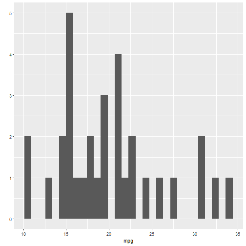

presentation-mtcars
========================================================
author: Andreas Olden
date: 22.01.2019
autosize: true


Creating an R presentation 
========================================================

An R-presentation produces HTML5 presentations. They can saved standalone or loaded to Rpubs for easy sharing. [Documentation here](https://support.rstudio.com/hc/en-us/articles/200486468)

- R-presentations load with a toy example for easy learning
- Creates nice presentation with code and/or output
- Uses the same simple Markdown format as the report 
  - Means you can copy paste code from presentation
  - You can use the resources presented in report_mtcars.Rmd

What is R presentations for and how to use them
========================================================
R-presentations are Markdown documents. This means that the same pros and cons apply here as in the report_mtcars.Rmd file. The easiest and most convenient way to work with them is with R code chunks and basic Markdown syntax. You can paste pictures, but Markdown syntax is not easy to manipulate, so scaling a picutre is hard. Also, external pictures, for instance saved in a local folder, does not alway load to the presentation preview, which is inconvenient. If you still reference an external image, you have to go into the menu more and click view in browser to get an idea on what it looks like. If you still want to do this, the easiest way is with html code which I will present. (There are other ways, but I have found them to be quite inconvenient) 


Paste code from report_mtcars.Rmd to create histogram
========================================================


```r
qplot(mpg, data = readRDS(here("data", "processed", "mtcars_df.Rds")))
```



Improvements
========================================================
The previous slide was messy. The title ran over several lines, taking a lot of space. We probably did not need the code that produced the plot, though this depends on the audience (teaching vs research). Finally, the figure was too small to read properly.

- Try turning off echo to remove code 
- Try turning off slide title
- Centering the figure
- Adjust size of the figure
- [Great cheat sheet for what to do in r code chunck](https://www.rstudio.com/wp-content/uploads/2015/03/rmarkdown-reference.pdf)

Slide With Plot
========================================================
title: false


Png in figures folder with html that is easy to scale
========================================================

<div align="center">

</div>
